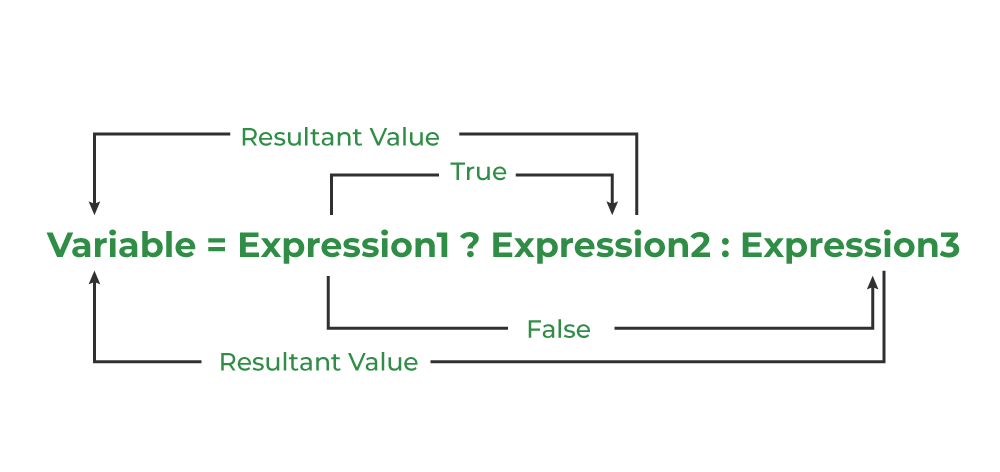

# Debugging

You can use whichever debugger you desire. In this example `gdb` is being used.

Start the debugger with the program in question:

```sh
gdb testVersion
```

Set a breakpoint to the function in question. For this we need to figure out where "stable" and "unstable" is being set. Looking at the *main* file `testVersion.c` we will see that only the function `display_version()` is being called over and over again. 
If we go into the file `version.c` we will see that `display_version()` is defined there. We can also use an LSP or any other desired method to quickly find out where `display_version()` is defined. 
We see that `display_version()` calls the functin `is_unstable()` to determine whether the minor version is stable or unstable.

Quick recall about the ternary operator:



*Source: https://www.geeksforgeeks.org/c/conditional-or-ternary-operator-in-c/*

Looking at the Code only:

```c
int is_unstable(struct version *v)
{
	return 1 & ((char *)v)[sizeof(unsigned short)];
}

void display_version(struct version *v)
{
	printf("%2u.%lu %s", v->major, v->minor,
	       is_unstable(v) ? "(unstable)" : "(stable)  ");
}
```

It should work. Any odd number ends on `1` in binary, e.g. `101 = 5`. Therefore `1 & 1` will return true and thus `unstable`. Even numbers will calculate to `1 & 0 = 0` therefore `stable`. In `gdb` we can use the `print` command (short `p`). Let's take a look at `v`.

```gdb
(gdb) p v
$2 = (struct version *) 0x7fffffffdf40
```

`v` points to the struct `version`. Through dereferencing it we get the values:

```gdb
(gdb) p *v
$3 = {major = 3, minor = 5, flags = 0 '\000'}
```

With `ptype /o` we can have a look at the layout.

```gdb
(gdb) ptype /o v
type = struct version {
/*      0      |       2 */    unsigned short major;
/* XXX  6-byte hole      */
/*      8      |       8 */    unsigned long minor;
/*     16      |       1 */    char flags;
/* XXX  7-byte padding   */

                               /* total size (bytes):   24 */
                             } *
```

Let's take a close look at `((char *)v)[sizeof(unsigned short)]`. The `sizeof(unsigned short)` returns 2 (Bytes).

```gdb
(gdb) p sizeof(unsigned short)
$4 = 2
```

At that point we are essentially doing `((char *)v)[2]`. Remember arrays. We are trying to access the Byte (`char`) that is after the first 2 Bytes (first two `char`s). 
The first 2 Bytes are the major version (here probably `0x00 03`), the rest is padded (in this case with zeroes). This is the reason why our `is_unstable()` function fails
